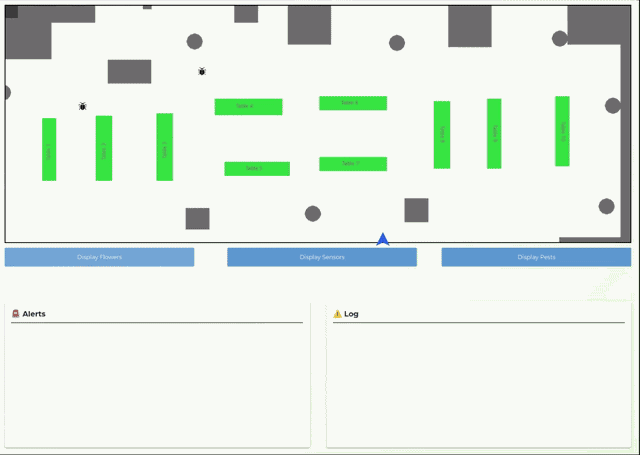

# MIRTE ROS2 Workspace for RO47007 with Pixi


This workspace contains the ROS 2 setup for simulation, autonomous planning, and control of MIRTE Master in the RO47007 context.

## Table of Contents

- [Demos](#demos)
- [Packages](#packages)
- [Prerequisites](#prerequisites)
- [1. Build the Workspace](#1-build-the-workspace)
- [2. Run in Simulation](#2-run-in-simulation)
- [3. Work with the Physical Robot](#3-work-with-the-physical-robot)
- [4. Set Up TypeDB](#4-set-up-typedb)
- [5. Run the Autonomous Planner](#5-run-the-autonomous-planner)
- [Troubleshooting](#troubleshooting)

## Demos

A quick look at the different parts of the system in action.

### Perception


Flower detection, tracking, and triangulation from the robot's camera.

### Autonomous Navigation


Autonomous waypoint navigation through the greenhouse.

### SLAM


Mapping the greenhouse with SLAM.

### Teleoperation


Manual driving of the MIRTE Master base with keyboard/joystick teleop.

### Monitoring GUI



The user-facing GUI showing flowers, sensors, pests, alerts, and the live log.

## Packages

Each ROS 2 package under `src/` has its own README with full node/topic/launch details:

| Package | Description |
|---|---|
| [`gh_twin`](src/gh_twin/README.md) | Gazebo simulation, SLAM, Nav2 navigation, joystick teleoperation, and the operator GUI |
| [`gh_twin_data_storage`](src/gh_twin_data_storage/README.md) | TypeDB world-state storage and the PDDL/POPF-based autonomous task scheduler |
| [`gh_twin_msgs`](src/gh_twin_msgs/README.md) | Shared custom message definitions (`Flower`, `Pest`, `Sensor`) |
| [`flower_perception`](src/flower_perception/README.md) | YOLOv8 flower/pest detection, tracking, and multi-view 3D triangulation |
| [`mirte_indicator_devices`](src/mirte_indicator_devices/README.md) | Audio and LED feedback devices (not yet wired into the rest of the system) |

## Prerequisites

> [!NOTE]
> Install Pixi first: [Pixi Installation Guide](https://pixi.prefix.dev/latest/installation/)

Required tools:

- Linux terminal
- `xterm`
- `git`

## 1. Build the Workspace

### 1.1 Clone and install environment

```shell
sudo apt install xterm

git clone git@gitlab.tudelft.nl:cor/ro47007/2026/group_17/mdp_mirte_ws.git $HOME/ro47007_mirte_ws
cd $HOME/ro47007_mirte_ws

pixi install
```

### 1.2 Fetch repositories

```shell
pixi run vcs import --input $HOME/ro47007_mirte_ws/repos.repos $HOME/ro47007_mirte_ws/src
```

### 1.3 Ignore unneeded packages

```shell
touch src/mirte-ros-packages/mirte_{bringup,telemetrix_cpp,teleop,test,zenoh_setup}/COLCON_IGNORE
```

### 1.4 Build

```shell
pixi shell
```

```shell
colcon build
```

> [!TIP]
> Build time can be significant depending on machine performance.

### 1.5 Clean build artifacts (optional)

```shell
pixi run ws-clean
```

Clean and build in one command:

```shell
pixi run clean-build
```

## 2. Run in Simulation

### 2.1 Start greenhouse simulation

```shell
pixi shell
```

```shell
source install/setup.bash
ros2 launch gh_twin greenhouse_launch.xml
```

> [!NOTE]
> This launch starts Gazebo with the MIRTE Master in the greenhouse world.

### 2.2 Keyboard teleop

Run from a second terminal:

```shell
pixi shell
```

```shell
source install/setup.bash
ros2 run teleop_twist_keyboard teleop_twist_keyboard --ros-args --remap cmd_vel:=/mirte_base_controller/cmd_vel_unstamped
```

### 2.3 SLAM launch

```shell
pixi shell
```

```shell
source install/setup.bash
ros2 launch gh_twin slam.launch.py
```

> [!IMPORTANT]
> Close `teleop_twist_keyboard` before launching SLAM, because the SLAM launch starts its own teleop flow.

## 3. Work with the Physical Robot

Connect to the MIRTE Master via Wi-Fi AP or Ethernet, then open your environment:

```shell
pixi shell
```

```shell
source install/setup.bash
ros2 topic list
```

> [!TIP]
> If topics are visible, connectivity and ROS graph discovery are working.

> [!NOTE]
> Every new pixi session requires you to set the domain ID.

## 4. Set Up TypeDB

The autonomous planner uses a TypeDB knowledge base to store environment data that PDDL uses for planning.

### 4.1 Install TypeDB

```shell
sudo apt install software-properties-common apt-transport-https gpg
gpg --keyserver hkp://keyserver.ubuntu.com:80 --recv-key 17507562824cfdcc
gpg --export 17507562824cfdcc | sudo tee /etc/apt/trusted.gpg.d/typedb.gpg > /dev/null
echo "deb https://repo.typedb.com/public/public-release/deb/ubuntu trusty main" | sudo tee /etc/apt/sources.list.d/typedb.list > /dev/null
sudo apt update
sudo apt install typedb=2.28.3
```

> [!IMPORTANT]
> TypeDB version 2.28.3 is required.

### 4.2 Start the server

In its own terminal:

```shell
typedb server
```

> [!NOTE]
> Keep this terminal open. Every function that uses TypeDB requires the server to stay connected.

### 4.3 Create and load the database

In a new terminal:

```shell
typedb console --core=localhost:1729
```

```shell
database create greenhouse
```

Load the schema:

```shell
transaction greenhouse schema write
source typedb_files/greenhouse-schema.tql
commit
```

Load the data:

```shell
transaction greenhouse data write
source typedb_files/greenhouse-data.tql
commit
```

Verify the schema loaded correctly:

```shell
database schema greenhouse
```

> [!TIP]
> You only need to go back into the TypeDB console later if you want to read or write the database manually.

## 5. Run the Autonomous Planner

POPF is used as the planner.

> [!NOTE]
> POPF is **not** available via `apt` on this setup (the system runs ROS Jazzy, while this workspace is a RoboStack/conda ROS Humble inside Pixi, and RoboStack does not package POPF). Instead it is built from source as part of the Pixi workspace: the `popf` source is listed in `repos.repos`, and its build dependencies (`flex`, `bison`, COIN-OR) are Pixi dependencies.

### 5.1 Fetch and build POPF

```shell
pixi run fetch          # clones popf (and the rest) into src/
pixi run build          # builds the workspace, including the popf binary
```

> [!TIP]
> The planner node finds the binary via the `POPF_BIN` environment variable, which Pixi sets automatically on activation (see `tools/popf_env.sh`) to `install/lib/popf/popf`. Override `POPF_BIN` if you have POPF installed elsewhere.

### 5.2 Configure waypoints

Put the waypoints in `gh_twin_data_storage/config/waypoint.yml`.

### 5.3 Run in simulation

With the `typedb server` terminal from [step 4.2](#42-start-the-server) still open:

```shell
pixi shell
```

```shell
source install/setup.bash
ros2 launch gh_twin greenhouse_launch.xml
```

In another terminal, run the planner:

```shell
pixi shell
```

```shell
source install/setup.bash
ros2 launch gh_twin_data_storage task_scheduler.launch.py
```

In another terminal, run the GUI:

```shell
pixi shell
```

```shell
cd src/gh_twin/gui/
python3 main.py
```

> [!NOTE]
> In the GUI, select "measurement mode". The planner should then start a plan and finish it.

### 5.4 Run on the physical robot

`greenhouse_launch.xml` is not needed on the physical robot. Complete the [TypeDB setup](#4-set-up-typedb), run the GUI, then launch:

```shell
pixi shell
```

```shell
source install/setup.bash
ros2 launch gh_twin_data_storage task_scheduler_hardware.launch.py
```

## Troubleshooting

> [!WARNING]
> Most setup issues are environment conflicts. Start by validating your shell and Python environment.

- **Python/Conda conflicts**
Deactivate Anaconda or other Python environment managers before building. They can interfere with Pixi and ROS 2 symlinks.

- **Non-Bash shell setup**
If you use ZSH or another shell, source the matching setup file from `install`, e.g. `setup.zsh`.

- **Pixi environment issues**
Recreate the Pixi environment with:

```shell
pixi clean
pixi install
```

- **Missing ROS packages in Pixi**
This workspace does not include every package from ROS Desktop Full. Add missing packages as needed, for example:

```shell
pixi add ros-humble-turtlesim
```

See the Pixi ROS 2 docs for details: [Pixi ROS 2 Tutorial](https://pixi.prefix.dev/latest/tutorials/ros2/)

- **Inconsistent setups across team members**
Compare changes with `git diff` and share lockfiles for reproducibility. Use the same `pixi.lock` to pin dependency versions.
